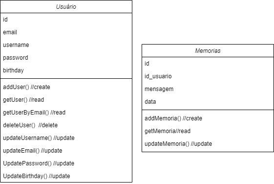

# Leaf :herb:

O seu aplicativo de recordação e organização pessoal. O LEAF além de notas você consegue armazenar suas melhores memórias no dia em que foram vividas para recordar no futuro.

Desenvolvido para disciplina de Laboratório de Desenvolvimento Mobile (PUC-Minas 2024/2)

### Equipe de Desenvolvimento :technologist:

- [Vitor Lúcio](https://github.com/VitorLucioOliveira)
- [Vitor Militão](https://github.com/militaovitor01)
- [Bruno Braga](https://github.com/Bruno0926)
- [Nagib Alexandre](https://github.com/NagibAlexandre)

## Funcionalidades Principais

### Diário de Memórias :notebook_with_decorative_cover:
Baseado no BeReal, o diário de memórias permite ao usuário salvar recordações em formato de texto. As recordações (memórias) podem ser inseridas manualmente, por meio do teclado, ou por transcrição de voz. Há também a possibilidade de salvar a sua localização junto à recordação .

  * Existe uma limitação de data: só é possível salvar ou editar memórias até 48 horas antes da data atual. Ou seja, é possível salvar memórias apenas no dia atual e no dia anterior.

### Lista de Memórias :spiral_notepad:
Utilizando as memórias salvas pelo usuário, é criada uma lista ordenada da mais recente para a mais antiga. É possível visualizar cada memória de maneira prática e baixar a lista completa em um arquivo local no formato .txt.

### Agenda :date:
Agenda local do aplicativo: é possível salvar eventos e lembretes futuros.

### Funcionalidades Adicionais
  - Manipulação de dados do usuário;
  - Descrição da Equipe e do Aplicativo;
  - Sequência de Memórias;

## Recursos Utilizados

### Banco de Dados 		:card_file_box:
- Banco de dados local (sqlite), descrito em *sql_helper.dart*
- Tabelas:
  - usuarios
  - memoria
 
  

### API :world_map:
Em relação a recursos externos, utilizamos a API do Google Maps para encontrar a localização do usuário e permitir que ela seja salva nas memórias.